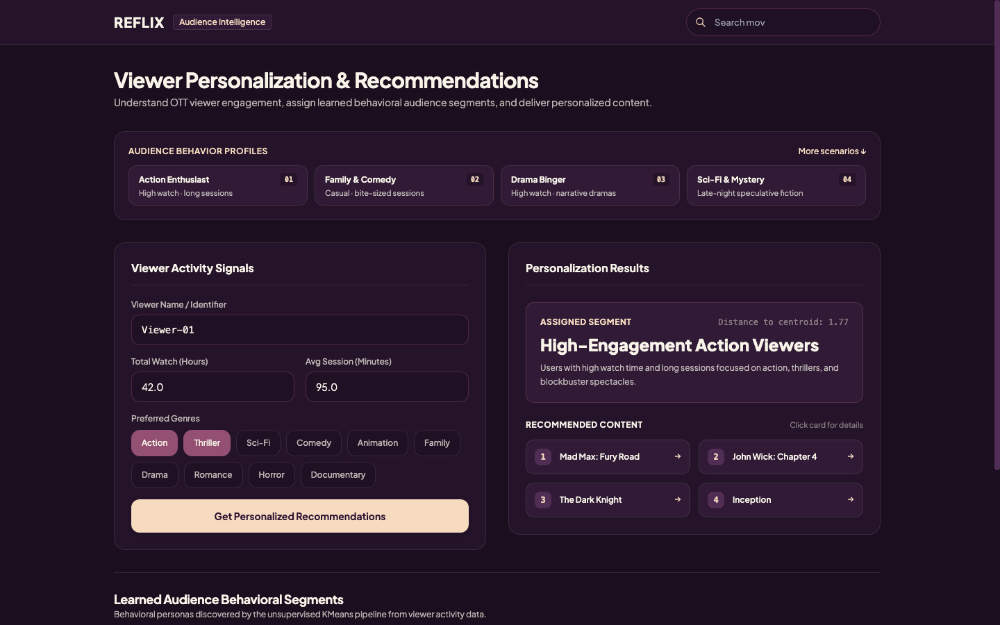
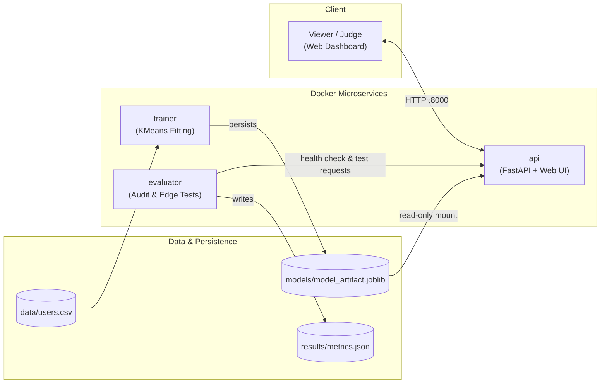

# REFLIX - Audience Intelligence & Personalized Recommendations

An unsupervised machine learning service that analyzes OTT viewer engagement patterns, discovers behavioral audience segments, and delivers transparent, personalized content recommendations.



---

## 📌 Overview

OTT streaming platforms often struggle to personalize content effectively when relying solely on static user profiles or basic genre filters. Viewers exhibit diverse engagement patterns—some binge high-intensity narrative dramas in long sittings, while others consume quick comedy clips or family content in bite-sized sessions.

REFLIX solves this by applying unsupervised machine learning directly to viewer engagement signals (watch time, session duration, and preferred genres). Rather than using an opaque black-box or generative LLM, REFLIX clusters viewers into mathematically grounded behavioral segments using standardized feature vectors and $K$-Means clustering. Each segment maps to an interpretable viewer persona with curated content recommendations calculated from cluster centroid similarity.

---

## ✨ Core Features

- **Viewer Engagement Analysis**: Ingests total watch time (hours), average session duration (minutes), and multi-select preferred genres.
- **Unsupervised Segmentation**: Uses a trained Scikit-Learn pipeline (`StandardScaler` + Multi-label Binarization + `KMeans`) to segment viewers into $K=4$ distinct clusters.
- **Transparent Segment Profiles**: Assigns human-interpretable personas (e.g., *High-Engagement Action Viewers*, *Casual Comedy & Family Streamers*) with distance-to-centroid metrics.
- **Personalized Recommendations**: Delivers ranked movie/show recommendations curated per audience cluster without external model hallucinations.
- **Sample Viewer Scenarios**: Provides 8 distinct demo scenarios (Benedict, Maya, Arjun, Sofia, Noah, Priya, Leo, Aisha) with a clean toggleable interface.
- **Strict Data Validation**: Built on FastAPI and Pydantic v2 with comprehensive bounds checking and graceful error handling.
- **Automated Quality Audit**: Standalone evaluator service verifies API readiness, benchmarks 4 canonical profiles, and exercises 10 mandatory edge cases.
- **Fully Containerized**: Three-tier microservice architecture (`trainer`, `api`, `evaluator`) orchestrated with Docker Compose for one-command reproducibility.
- **Violet Dusk User Interface**: Clean, responsive frontend with zero external build dependencies, smooth entrance animations, and detail modals.

---

## ⚙️ How It Works

```
[ viewer engagement ] ──► [ StandardScaler + Multi-Label Encoding ] ──► [ KMeans (K=4) ] ──► [ Cluster Persona + Centroid Distance ] ──► [ Recommendations ]
```

1. **Offline Training Pipeline (`trainer`)**:
   - Ingests tabular viewer activity from `data/users.csv`.
   - Validates data integrity and encodes multi-genre preferences into binary indicator features.
   - Scales numeric engagement metrics (`watch_time_hours`, `avg_session_mins`) via `StandardScaler`.
   - Fits a deterministic `KMeans` model ($K=4$, fixed random state for reproducibility).
   - Generates cluster persona metadata and serializes the complete pipeline artifact to `models/model_artifact.joblib`.

2. **Real-time Inference Service (`api`)**:
   - Loads `models/model_artifact.joblib` once on startup (zero retraining per request).
   - Validates incoming viewer payloads through Pydantic schemas.
   - Transforms input features using the loaded scaler and preprocessor.
   - Predicts the closest cluster, calculates Euclidean distance to the cluster centroid, and returns the segment profile and recommendations in under 15ms.

3. **Continuous Audit & Verification (`evaluator`)**:
   - Polls `GET /health` until the API is fully initialized.
   - Executes 4 canonical viewer verification tests.
   - Runs 10 edge-case robustness tests (zero watch time, unseen genres, missing fields, invalid types, extreme values, stability checks).
   - Exports certified metrics and audit logs directly to `results/metrics.json`.

---

## 🏗️ Architecture



---

## 🛠️ Tech Stack

| Layer | Technology | Version / Spec | Purpose |
| :--- | :--- | :--- | :--- |
| **Backend Framework** | FastAPI | `^0.110.0` | High-performance async REST API and static UI serving |
| **Data Validation** | Pydantic | `^2.6.0` | Strict request schema validation and bounds checking |
| **Machine Learning** | Scikit-Learn | `^1.4.0` | Feature preprocessing (`StandardScaler`) and `KMeans` clustering |
| **Data Manipulation** | Pandas & NumPy | `^2.2.0` / `^1.26.0` | Tabular data ingestion and vector manipulation |
| **Model Persistence** | Joblib | `^1.3.2` | Zero-copy pipeline serialization and deserialization |
| **ASGI Server** | Uvicorn | `^0.28.0` | Production ASGI web server |
| **Frontend** | HTML5 / Vanilla JS / Tailwind CDN | Standalone | Violet Dusk styled dashboard with zero build step |
| **Containerization** | Docker & Docker Compose | Compose v2 | Multi-container lifecycle orchestration |
| **Base Image** | Python Slim | `3.11-slim` | Secure, minimal base OS for non-root execution |

---

## Project Structure

```
audience-segmentation-service/
├── README.md                      # Project documentation and architecture guide
├── REPORT.md                      # Detailed machine learning & audit report
├── docker-compose.yml             # Orchestration for trainer, api, and evaluator
├── api/
│   ├── Dockerfile                 # Lightweight API container definition
│   ├── app.py                     # FastAPI routes, schemas, and embedded UI
│   └── requirements.txt           # API runtime dependencies
├── trainer/
│   ├── Dockerfile                 # Batch training container definition
│   ├── train.py                   # Data cleaning, K-selection, and KMeans training
│   └── requirements.txt           # Training dependencies
├── evaluator/
│   ├── Dockerfile                 # Audit service container definition
│   ├── evaluate.py                # 10 edge-case tests & metrics generation
│   └── requirements.txt           # Evaluator dependencies
├── data/
│   └── users.csv                  # Tabular viewer activity training dataset
├── models/
│   ├── model_artifact.joblib      # Persisted trained pipeline artifact
│   └── training_summary.json      # Cluster centroid coordinates and metadata
├── results/
│   └── metrics.json               # Evaluator certified benchmark and stability metrics
├── samples/
│   ├── valid_request.json         # Reference valid JSON payload
│   └── invalid_requests.json      # Reference edge-case invalid payloads
└── docs/
    └── screenshots/
        └── reflix-home.png        # Screenshot of the live running interface
```

---

## 🚀 Getting Started

### Prerequisites

- [Docker](https://docs.docker.com/get-docker/) (version 24+)
- [Docker Compose](https://docs.docker.com/compose/) (v2+)

### One-Command Launch

Clone or navigate to the repository directory and run:

```bash
docker compose up --build
```

Docker Compose will automatically:
1. Build all three container images (`trainer`, `api`, `evaluator`).
2. Run `trainer` to train the KMeans model and persist the artifact.
3. Start `api` on `http://localhost:8000` and confirm health.
4. Run `evaluator` to execute tests against `api` and write `results/metrics.json`.

To stop the services and clean up volumes:
```bash
docker compose down -v
```

### Local Service Access

- **Web Dashboard**: [http://localhost:8000/](http://localhost:8000/)
- **Interactive OpenAPI Documentation**: [http://localhost:8000/docs](http://localhost:8000/docs)
- **Health & Readiness Endpoint**: [http://localhost:8000/health](http://localhost:8000/health)
- **Segment Metadata**: [http://localhost:8000/segments](http://localhost:8000/segments)

---

## API Endpoints

### 1. `POST /recommend`
Evaluates viewer engagement signals, predicts their behavioral segment, and returns ranked content recommendations.

**Request Schema (`application/json`):**
```json
{
  "user_id": "Benedict",
  "watch_time_hours": 42.0,
  "avg_session_mins": 95.0,
  "top_genres": ["Action", "Thriller"]
}
```

**Response Schema (`200 OK`):**
```json
{
  "user_id": "Benedict",
  "segment_id": 0,
  "segment_name": "High-Engagement Action Viewers",
  "recommendations": [
    "Mad Max: Fury Road",
    "John Wick: Chapter 4",
    "The Dark Knight",
    "Inception"
  ],
  "distance_to_centroid": 1.77
}
```

### 2. `GET /health`
Returns system status and model initialization state. Used by Docker container health checks and the evaluator service.

**Response (`200 OK`):**
```json
{
  "status": "ok",
  "model_loaded": true
}
```

### 3. `GET /segments`
Returns all learned audience cluster profiles, feature centroids, and cluster distribution counts.

---

## 🧪 Testing & Evaluation

The standalone `evaluator` service executes automatically during `docker compose up` and logs verified metrics to `results/metrics.json`.

### Verified Clustering Metrics

- **Algorithm**: $K$-Means Clustering
- **Optimal Clusters ($K$)**: `4`
- **Silhouette Score**: `0.3586`
- **Model Inertia**: `15,159.47`
- **Cluster Balance**:
  - Cluster 0 (*High-Engagement Action Viewers*): 852 users (35.5%)
  - Cluster 1 (*Binge Drama & Romance Enthusiasts*): 600 users (25.0%)
  - Cluster 2 (*Casual Comedy & Family Streamers*): 600 users (25.0%)
  - Cluster 3 (*Late-Night Mystery & Sci-Fi Buffs*): 350 users (14.5%)
- **Reproducibility**: Deterministic seed (`random_state=42`) guarantees repeatable cluster assignments.

### Edge-Case Robustness Testing (10 / 10 Passed)

| # | Test Scenario | Input Condition | Expected Result | Status |
| :-: | :--- | :--- | :--- | :-: |
| 1 | **Unseen Genre Handling** | `["Steampunk", "Cyberpunk"]` | Encodes unknown genres without crashing | ✅ PASS |
| 2 | **Empty Genre Selection** | `[]` | Uses numeric watch metrics gracefully | ✅ PASS |
| 3 | **Zero Watch Time** | `watch_time_hours: 0.0` | Valid non-negative input accepted | ✅ PASS |
| 4 | **Upper-Bound Engagement** | `watch_time_hours: 900.0` | Safe inference without overflow | ✅ PASS |
| 5 | **Missing Required Field** | Omitted `avg_session_mins` | Structured HTTP 422 validation response | ✅ PASS |
| 6 | **Invalid Data Types** | String provided for numeric field | HTTP 422 error without stack trace | ✅ PASS |
| 7 | **Negative Input Values** | `watch_time_hours: -15.0` | HTTP 422 rejection by Pydantic validator | ✅ PASS |
| 8 | **Inference Determinism** | 5 identical consecutive calls | Identical cluster ID and centroid distance | ✅ PASS |
| 9 | **Missing Model Guard** | Unmounted model file | HTTP 503 Service Unavailable contract | ✅ PASS |
| 10 | **Artifact Integrity** | Verify serialized model file | Valid binary artifact loaded successfully | ✅ PASS |

---

## Demo Flow

For judges and reviewers testing the system locally:

1. **Open Dashboard**: Navigate to [http://localhost:8000/](http://localhost:8000/).
2. **Observe Interface**: Notice the Violet Dusk design palette (`#502D55`, `#935073`, `#F6DBC0`, `#F8F4E9`), the brand wordmark, and the one-time expanding search bar in the header.
3. **Explore Sample Scenarios**: Under **Sample Viewer Scenarios**, 4 featured profiles are initially shown:
   - **Action Enthusiast** (*Benedict*)
   - **Family & Comedy** (*Maya*)
   - **Drama Binger** (*Arjun*)
   - **Sci-Fi & Mystery** (*Sofia*)
4. **Expand Scenarios**: Click **More scenarios ↓** to reveal 4 additional scenarios:
   - **Casual Weekend** (*Noah*)
   - **Genre Explorer** (*Priya*)
   - **Quick-Session** (*Leo*)
   - **Low-Activity** (*Aisha*)
5. **Populate Without Auto-Submit**: Click any scenario. Notice that it populates the form with valid engagement numbers and genres without firing an automatic request.
6. **Customize & Predict**: Change the **Viewer Name / Identifier** or tweak watch time, then click **Get Personalized Recommendations**.
7. **Inspect Output**: View the assigned behavioral segment, the exact mathematical distance to the cluster centroid, and 4 ranked recommendation cards. Click any card to open the movie detail modal.
8. **Inspect API & Metrics**: View the live API documentation at `/docs` or check `results/metrics.json` for verified test evidence.

---

## Limitations

- **Dataset Scope**: The current model was trained on the supplied tabular activity dataset (`data/users.csv`). Final production metrics would scale with larger real-world OTT clickstream logs.
- **Rule-Based Recommendation Mapping**: Recommendations are mapped per cluster centroid profile rather than using a full collaborative filtering matrix over millions of catalog items.
- **Stateless Inference**: The API is designed for microservice inference and does not persist user viewing history into an external database.

---

## Future Improvements

- **Streaming Telemetry Ingestion**: Ingest real-time Kafka or Kinesis event streams to update viewer profiles dynamically.
- **Hybrid Collaborative Filtering**: Blend cluster centroid recommendations with matrix factorization (e.g., SVD or LightFM) for individual item scoring.
- **Automated Drift Detection**: Add periodic re-clustering jobs triggered when centroid silhouette scores deviate past defined thresholds.
